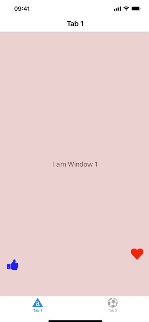
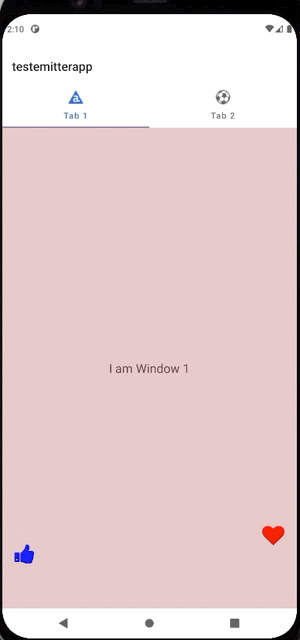

# Titanium Emitter View Module

A cross-platform Titanium module for creating beautiful particle emission effects (like "Like" animations on social media).

 | 

## Installation

Add the module to your `tiapp.xml`:

```xml
<modules>
    <module platform="iphone">de.marcbender.emitterview</module>
    <module platform="android">de.marcbender.emitterview</module>
</modules>
```

## Usage

```javascript
var emitterModule = require('de.marcbender.emitterview');

// Create emitter view
var emitterView = emitterModule.createView({
    top: 0,
    left: 0,
    right: 0,
    bottom: 0,
    width: Ti.UI.FILL,
    height: Ti.UI.FILL,
    
    // Particle configuration
    amplitude: 8,              // Minimum horizontal sway (default: 8)
    maxAmplitude: 14,          // Maximum horizontal sway (default: 14)
    duration: 3.0,             // Minimum animation duration in seconds (default: 3.0)
    maxDuration: 3.5,          // Maximum animation duration in seconds (default: 3.5)
    direction: 0,              // Emission direction: 0=up, 1=down, 2=left, 3=right (default: 0)
    
    // Particle images (array of image paths, Ti.Blob, or Ti.Filesystem.File)
    particleImages: [
        '/images/heart.png',
        Ti.UI.createLabel({
            text: '❤️',
            font: { fontSize: 40 }
        }).toImage()
    ]
});

win.add(emitterView);
```

## API

### `createView(properties)`

Creates a new emitter view.

| Property | Type | Required | Default | Description |
|----------|------|----------|---------|-------------|
| `amplitude` | Number | No | 8 | Minimum horizontal sway in pixels |
| `maxAmplitude` | Number | No | 14 | Maximum horizontal sway in pixels |
| `duration` | Number | No | 3.0 | Minimum animation duration in seconds |
| `maxDuration` | Number | No | 3.5 | Maximum animation duration in seconds |
| `direction` | Number | No | 0 | Emission direction (0=up, 1=down, 2=left, 3=right) |
| `particleImages` | Array | Yes | - | Array of images to emit |

### `emitImage(options)`

Emits a particle from the source view.

| Option | Type | Required | Default | Description |
|--------|------|----------|---------|-------------|
| `sourceView` | Ti.UI.View | Yes | - | The view to emit particles from |
| `id` | Number | No | - | Emit a specific image (1-based index) |
| `startId` | Number | No | - | Start range for random image selection (1-based) |
| `endId` | Number | No | - | End range for random image selection (1-based) |

**Note:** Use only one of: `id`, or `startId`+`endId` together. If neither is specified, a random image is selected.

## Example

```javascript
var emitterModule = require('de.marcbender.emitterview');

// Create emitter
var emitterView = emitterModule.createView({
    top: 0,
    left: 0,
    width: Ti.UI.FILL,
    height: Ti.UI.FILL,
    amplitude: 8,
    maxAmplitude: 14,
    duration: 3.0,
    maxDuration: 3.5,
    direction: 0, // up
    particleImages: ['/images/heart.png', '/images/star.png']
});

win.add(emitterView);

// Create button to emit from
var button = Ti.UI.createView({
    width: 60,
    height: 60,
    bottom: 100,
    left: 20
});

var label = Ti.UI.createLabel({
    text: '❤️',
    font: { fontSize: 40 },
    width: Ti.UI.SIZE,
    height: Ti.UI.SIZE
});

button.add(label);
win.add(button);

// Emit on touch
button.addEventListener('touchstart', function(e) {
    emitterView.emitImage({
        sourceView: button,
        // Optional: specific image
        // id: 1,
        // Optional: random from range
        // startId: 1,
        // endId: 2
    });
});
```

## Direction Examples

```javascript
// Upward (default - like social media reactions)
direction: 0

// Downward (rain/snow effect)
direction: 1

// Left (wind effect)
direction: 2

// Right (wind effect)
direction: 3
```

## Performance Notes

- **iOS**: Uses Core Animation with CAKeyframeAnimation for smooth 60fps animations
- **Android**: Uses Android AnimationSet with TranslateAnimation and AlphaAnimation
- Maximum 100 concurrent particles (configurable via `maximumCount` on iOS)
- Images are cached for better performance on repeated emissions
- Path generation optimized to 40 key points instead of pixel-by-pixel

## Requirements

- **iOS**: 12.0+
- **Android**: API 21+ (Android 5.0)
- **Titanium SDK**: 10.1.0+

## License

MIT

## Author

Marc Bender
