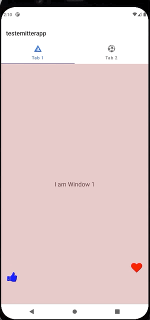

# Titanium image-emitter-view module 

## Methods

### MODULE  -> `createView({properties}) `
returns the **emitterViewObject**

## Properties

### `amplitude:INTEGER`

### `maxAmplitude:INTEGER`

### `duration:FLOAT(in seconds like 2.5)`

### `maxDuration:FLOAT(in seconds like 3.5)`

### `particleImages:ARRAY (blob, imagePath)`

## emitterViewObject Methods
### `emitImage({properties}) `

## Properties

### `sourceView:Ti.UI.VIEW` (obligatory)

### `startId:INTEGER (starting with 1)` (optional, when set, also '***endId***' must be set)

### `endId:INTEGER (the particleImages.length)` (optional)

### `id:INTEGER (starting with 1, a specific image from the particleImages array to emit)` (optional)

## Example

see the included demo project

## License

MIT

## Author

Marc Bender
